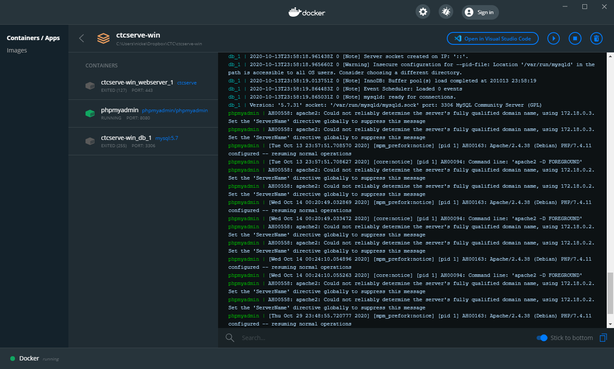

# ctcserve
Webserver docker configuration for CTC

## Installation and Setup

These instructions have been tested on Windows and Mac OSX, and should also work on Linux without too much hassle. From Windows the commands given below can be executed from a command prompt or powershell.

Install [docker desktop](https://www.docker.com/products/docker-desktop)

Clone the repo:
```
git clone https://github.com/ctcit/ctcserve.git
```
Change to the `ctcserve` directory and build:
```
cd ctcserve
docker-compose build
```
Then start the server:
```
docker-compose up -d
```
Note that the first time you start the server some additional build actions may be needed which may take a few minutes - these will not be required after the first start up and generally the server should start in just a few seconds. If all goes well the last three lines should read:
```
Creating ctcserve-win_db_1 ... done
Creating phpmyadmin               ... done
Creating ctcserve-win_webserver_1 ... done   
```
Check that everything is running OK by executing:
```
docker-compose ps
```
If everything is OK all three containers should have Status "Up". In this case you should be able to access the website homepage at http://localhost and the PHP MyAdmin instance at http://localhost:8080

## Usage

To start the server, from the top-level directory of `ctcserve` (the one containing the `docker-compose.yaml` file), run:
```    
docker-compose up -d
```    
To stop the server, run
```
docker-compose down
```    
To view logs:
```
docker logs -f --details ctcserve_webserver_1
```    
Get a shell terminal on the webserver:
```
docker-compose exec webserver /bin/bash
```    
Check container statuses:
```
docker-compose ps
```

`Docker Desktop` on Windows gives you a handy GUI where you can see the container logs which is useful for trouble-shooting.


